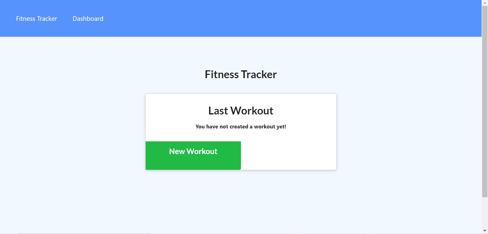

  # Workout Tracker

  
  

      

  ### Table of Contents
  [Description](https://github.com/DeviantSchemist/WorkoutTracker#description)

  [Installation](https://github.com/DeviantSchemist/WorkoutTracker#installation)

  [Usage](https://github.com/DeviantSchemist/WorkoutTracker#usage)

  [Contribution](https://github.com/DeviantSchemist/WorkoutTracker#contribution)

  [Tests](https://github.com/DeviantSchemist/WorkoutTracker#tests)

  [Questions](https://github.com/DeviantSchemist/WorkoutTracker#questions)

  ## Description
  An application that allows users to keep track of their fitness data.

  ## Installation
  Git clone this repository somewhere onto your local computer.

  ## Usage
  Have Node.js installed on a text editor/IDE of your choice. Then run "npm i" in order to install all of the dependencies. After everything finishes downloading, run "npm start" to start the server. Now go onto localhost:3000 in Google Chrome and see this app in action! You can also use the Heroku link.

  ## Contribution
  Git clone this repository onto your local computer. Then create a new branch named after whatever feature you are implementing. After you are done, submit a pull request for further review.

  ## Tests
  Follow the button prompts such as "Add New Exercise" to see if they actually work. Click all of the buttons you can find and enter whatever you are able to enter in any of the fields.

  ## Screenshot
  

  ## Questions
  If you have additional questions, please see below for my contact information.

  Github: [deviantschemist](https://github.com/deviantschemist)

  Email: michaelngo1337@yahoo.com
  